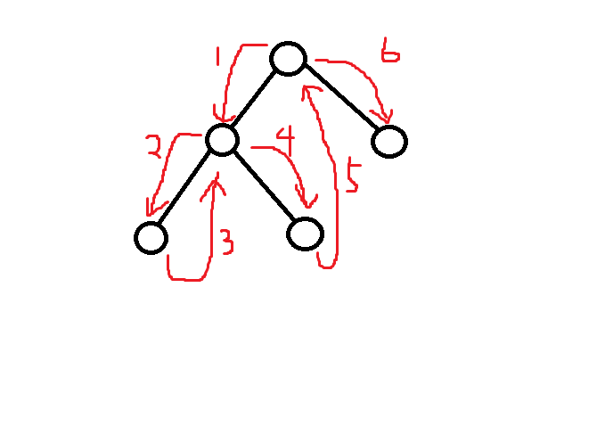

# Morris Traversal

Problem Link: [ACMOJ1826](https://acm.sjtu.edu.cn/OnlineJudge/problem/1826)

## Background

遍历一棵 **二叉** 树？那必然是 `DFS` 啊，好写又快，就算考虑到递归层数太多爆栈，写 `BFS` 就好了啊。

但是，如果只用 $O(1)$ 的额外空间呢？DFS 的话可能要用 $O(N)$ 的空间诶（当树退化成一条链的时候）。

~~for i = 1 to n~~

（注意下，不要搞，也没必要搞一些小聪明，比如说把边取负来标记这条边有没有访问过这些，完全没必要啊）

这时候，Morris Traversal 就可以不用递归、不用栈/队列、只用 $O(1)$ 额外空间遍历一棵树。

[Morris' tree traversal algorithm reconsidered](https://www.sciencedirect.com/science/article/pii/0167642388900639)

## Morris Traversal

我们先来讲述一下算法的流程。

1. 当前结点为 $u$，算法最开始时设为根结点。
2. 如果 $u$ 没有左儿子，将 $u$ 设为它的右儿子（即往右走），回到步骤 1。
3. 找到 $u$ 左子树中最“右”的结点 $v$（最右的结点指的是中序遍历最后遍历到的结点，可以通过从 $u$ 的左儿子不断往右找到）。
4. 如果 $v$ 没有右儿子，那么将 $v$ 的右儿子设为 $u$，然后把 $u$ 设为 $u$ 的左儿子（即往左走），回到步骤 1。
5. 如果 $v$ 的右儿子是 $u$，将 $v$ 的右儿子改回空，然后把 $u$ 设为 $u$ 的右儿子（即往右走），回到步骤1。（注：$v$ 的右子树只有可能是这两种情况）

这个算法为什么是正确的呢？

当前我们在 $u$，我们将会把左子树遍历一遍，然后继续遍历右子树。左子树中的最右结点 $v$ 本来是没有右儿子的，我们把它的右儿子设为 $u$，这样，在遍历完左子树到达最后（中序）遍历到的结点 $v$ 的时候，由于 $v$ 的右儿子是非空的，我们将会继续遍历 $v$ 的右儿子，实际上我们却回到了结点 $u$，然后再找左子树中最右节点就可以发现它的右儿子已经设为 $u$，说明 $u$ 实际上并不是 $v$ 的右子树，并且 $u$ 的左子树已经遍历完了，可以开始遍历右子树了，于是把 $u$ 设为它的右儿子然后继续遍历。



```cpp title="acmoj1826.cpp" linenums="1"
#include <iostream>
#define N 1000

using namespace std;

struct tree {
  int left;
  int right;
  int v;
} ts[N];

int sum() {
    int x = 0, s = 0;
    while( x != -1 ){
        if ( ts[x].left == -1 ){
            s += ts[x].v; // 没有左子树，直接走右结点
            x = ts[x].right;
        } else {
            int y = ts[x].left;
            while( ts[y].right != -1 && ts[y].right != x ) // 找到左子树的最右结点
                y = ts[y].right;
            if ( ts[y].right == -1 ){ // 左子树还没有遍历过
                s += ts[x].v;
                ts[y].right = x;
                x = ts[x].left; 
            } else { // 左子树已经遍历完了
                ts[y].right = -1;
                x = ts[x].right;
            }
    }
    return s;
}

int main() {
  int n;

  cin >> n;
  for (int i = 0; i < n; i++) {
    cin >> ts[i].left;
    cin >> ts[i].right;
    cin >> ts[i].v;
  }
  cout << sum();
}
```

可以发现，我们现在的遍历顺序是前序遍历。只要稍加修改，就可以变成中序遍历。

那么，问题来了，怎样用 $O(1)$ 额外空间实现后序遍历？最佳回答：我不知道。